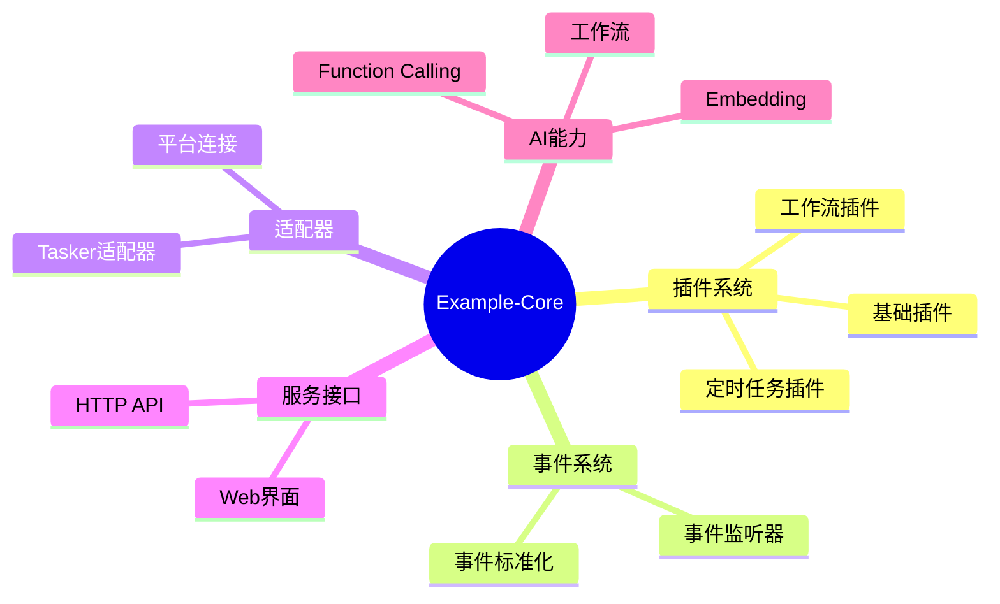

# Example-Core 示例核心

本目录为 XRK-AGT 的**示例 Core**，用于学习与参考。框架会按目录自动加载本 Core 下的 plugin、events、http、stream、tasker、www，无需在 `index.js` 中列出模块或加载模块，其次就是这个Core可以和自带的 system-Core 作为 ai 参考的两个重要的 Core

## ⚠️ 导入路径

**Example-Core 使用相对路径**，不使用 Node 的 `#imports` 别名：

- ✅ `import BotUtil from '../../../src/utils/botutil.js'`
- ❌ `import BotUtil from '#utils/botutil.js'`

原因：本 Core 有独立 `package.json`，`imports` 作用域在包内，无法引用上层 `src/`，故使用相对路径。

## 📁 目录结构

```
Example-Core/
├── .gitignore
├── package.json
├── README.md
├── index.js             # 入口（仅说明，框架按目录自动发现）
├── plugin/
│   ├── example-basic.js
│   ├── example-workflow.js
│   └── example-timer.js
├── events/
│   └── example-custom.js
├── http/
│   └── example-api.js
├── stream/
│   └── example-stream.js
├── tasker/
│   └── example-tasker.js
└── www/
    └── example/
        └── example.html
```

## 🏗️ 架构图

### 框架模块关系


### 数据流向


### 模块功能分类



## 🚀 快速开始

### 安装和使用

1. **克隆或下载本仓库**
   ```bash
   git clone <repository-url>
   cd XRK-Core
   ```

2. **安装依赖**（如果需要）
   ```bash
   npm install
   # 或
   pnpm install
   ```

3. **集成到 XRK-AGT 框架**
   - 将 `XRK-Core` 文件夹复制到主项目的 `core/` 目录下
   - 框架会自动扫描并加载示例代码
   - 根据实际需求修改示例代码

4. **单独使用**
   - 每个示例文件都是独立的
   - 可以直接复制到你的项目中使用
   - 根据框架文档调整导入路径

### 1. 插件开发（Plugin）

插件是框架中最常用的功能模块，用于处理消息事件。

**基础插件示例** (`plugin/example-basic.js`)
- ✅ 消息匹配和响应
- ✅ 命令处理（#帮助、#信息等）
- ✅ 参数解析和验证
- ✅ 多种消息处理模式
- ✅ 计算、随机数等实用功能

**工作流插件示例** (`plugin/example-workflow.js`)
- ✅ 集成 AI 工作流
- ✅ 选项配置（记忆、待办、数据库）
- ✅ 错误处理
- ✅ 命令行参数解析

**定时任务插件示例** (`plugin/example-timer.js`)
- ✅ Cron 表达式配置
- ✅ 定时任务执行（每小时、每天、每周）
- ✅ 日志记录
- ✅ 任务管理

### 2. 事件监听器（Event Listener）

事件监听器用于接收和处理来自不同平台的事件。

**自定义事件监听器示例** (`events/example-custom.js`)
- ✅ 事件注册和处理
- ✅ 事件标准化
- ✅ 适配器标记
- ✅ 资源清理
- ✅ 自定义字段处理

### 3. HTTP API

HTTP API 用于提供 Web 服务接口。

**HTTP API 示例** (`http/example-api.js`)
- ✅ RESTful API 设计
- ✅ GET、POST、PUT、DELETE 请求处理
- ✅ 参数验证和错误处理
- ✅ 文件上传示例
- ✅ 认证中间件示例
- ✅ 分页列表示例
- ✅ 错误处理演示

### 4. AI 工作流（Stream）

AI 工作流用于处理复杂的 AI 对话和任务。

**工作流示例** (`stream/example-stream.js`)
- ✅ 工作流初始化和配置
- ✅ 系统提示词构建
- ✅ 聊天上下文管理
- ✅ Function Calling 注册（时间、计算、文本处理）
- ✅ 错误处理
- ✅ 自定义函数示例

### 5. Tasker 适配器

Tasker 用于连接不同的聊天平台（QQ、微信、Telegram 等）。

**Tasker 示例** (`tasker/example-tasker.js`)
- ✅ 消息发送和接收
- ✅ 事件处理
- ✅ 消息格式转换
- ✅ 文件处理
- ✅ 错误处理
- ✅ 连接管理

### 6. Web 界面

Web 界面用于提供用户交互界面。

**Web 界面示例** (`www/example.html`)
- ✅ 简洁美观的 UI 设计
- ✅ API 调用示例
- ✅ 响应式布局
- ✅ 错误处理
- ✅ 加载状态显示

## 📖 详细说明

### 插件开发

插件继承自 `plugin` 类，通过 `rule` 配置匹配规则：

```javascript
export default class MyPlugin extends plugin {
  constructor() {
    super({
      name: '插件名称',
      dsc: '插件描述',
      event: 'message',
      priority: 5000,
      rule: [
        {
          reg: '^命令$',      // 正则匹配
          fnc: 'handlerMethod', // 处理方法
          permission: 'all'     // 权限控制：all/master/admin/member
        }
      ]
    })
  }

  async handlerMethod() {
    // this.e 是事件对象
    // this.reply() 用于回复消息
    await this.reply('响应消息')
    return true  // 返回 true 表示已处理
  }
}
```

**权限说明**：
- `all` - 所有人可用
- `master` - 仅主人可用
- `admin` - 管理员可用
- `member` - 群成员可用

### 定时任务

使用 Cron 表达式定义定时任务：

```javascript
task: [
  {
    name: '任务名称',
    cron: '0 * * * *',  // 每小时执行
    fnc: 'taskMethod',
    log: true  // 是否记录日志
  }
]
```

**常用 Cron 表达式**：
- `0 * * * *` - 每小时
- `0 9 * * *` - 每天 9:00
- `0 10 * * 1` - 每周一 10:00
- `*/5 * * * *` - 每 5 分钟
- `0 0 * * *` - 每天 0:00
- `0 0 * * 0` - 每周日 0:00

**Cron 格式**：`分钟 小时 日 月 星期`

### HTTP API

HTTP API 使用对象导出方式：

```javascript
import { HttpResponse } from '../../../src/utils/http-utils.js';

export default {
  name: 'api-name',
  dsc: 'API 描述',
  priority: 100,
  routes: [
    {
      method: 'GET',
      path: '/api/endpoint',
      handler: HttpResponse.asyncHandler(async (req, res) => {
        // req.query - 查询参数
        // req.params - 路径参数
        // req.body - 请求体
        HttpResponse.success(res, { data: 'result' })
      }, 'handler.name')
    }
  ]
}
```

**响应方法**：
- `HttpResponse.success(res, data)` - 成功响应
- `HttpResponse.error(res, message, code)` - 错误响应
- `HttpResponse.validationError(res, message)` - 验证错误
- `HttpResponse.notFound(res, message)` - 未找到
- `HttpResponse.unauthorized(res, message)` - 未授权

### AI 工作流

工作流继承自 `AIStream`，使用 **registerMCPTool** 注册工具（供 LLM 调用）：

```javascript
import AIStream from '../../../src/infrastructure/aistream/aistream.js';

export default class MyStream extends AIStream {
  constructor() {
    super({
      name: 'my-stream',
      description: '工作流描述',
      config: { temperature: 0.8, maxTokens: 6000, topP: 0.9 },
      embedding: { enabled: true }
    });
  }

  async init() {
    await super.init();
    this.registerMCPTool('my_tool', {
      description: '工具描述',
      inputSchema: { type: 'object', properties: { key: { type: 'string' } }, required: ['key'] },
      handler: async (params) => this.successResponse(params)
    });
  }

  async process(e, input, options = {}) {
    const question = typeof input === 'string' ? input : (input?.text || input?.message || '');
    const messages = await this.buildChatContext(e, { text: question });
    const response = await this.callAI(messages, this.config);
    return response;
  }
}
```

### Tasker 适配器

Tasker 用于连接不同的聊天平台：

```javascript
Bot.tasker.push(
  new (class MyTasker {
    id = "PLATFORM_ID"
    name = "PlatformName"
    echo = new Map()
    timeout = 60000

    sendFriendMsg(data, msg) {
      // 发送好友消息
    }

    sendGroupMsg(data, msg) {
      // 发送群消息
    }

    async recallMsg(data, message_id) {
      // 撤回消息
    }
  })()
)
```

### 事件监听器

事件监听器用于接收和处理平台事件：

```javascript
import EventListenerBase from '../../../src/infrastructure/listener/base.js';

export default class MyListener extends EventListenerBase {
  constructor() {
    super('listener-name')
  }

  async init() {
    const bot = this.bot || Bot
    bot.on('custom.event', (e) => this.handleEvent(e))
  }

  async handleEvent(e) {
    this.ensureEventId(e)
    if (!this.markProcessed(e)) return
    this.normalizeEvent(e)
    await this.plugins.deal(e)
  }
}
```

### Web 界面

Web 界面是独立的 HTML 文件，可以通过 HTTP API 与框架交互：

```html
<!DOCTYPE html>
<html>
<head>
  <title>示例界面</title>
</head>
<body>
  <script>
    // 调用 API
    fetch('/api/example/hello')
      .then(res => res.json())
      .then(data => console.log(data));
  </script>
</body>
</html>
```

## 🔧 配置说明

### 加载方式

框架会**按目录自动扫描**并加载各 Core 下的：

- `plugin/*.js` → 插件
- `events/*.js` → 事件监听器
- `http/*.js` → HTTP API
- `stream/*.js` → 工作流
- `tasker/*.js` → Tasker 适配器（需在文件中 `Bot.tasker.push(实例)`）
- `www/**` → 静态页面

无需在 `index.js` 中列出上述模块。

### 优先级

- `priority` 值越小，优先级越高
- 插件按优先级顺序处理消息
- 相同优先级的插件按加载顺序处理

### 文件命名规范

- 插件文件：`plugin/example-*.js`
- 事件监听器：`events/example-*.js`
- HTTP API：`http/example-*.js`
- 工作流：`stream/example-*.js`
- Tasker：`tasker/example-*.js`
- Web 文件：`www/*.html`

### 导入路径

- 从 `core/Example-Core/*` 引用 `src/utils/*`：`../../../src/utils/*`
- 从 `core/Example-Core/*` 引用 `src/infrastructure/*`：`../../../src/infrastructure/*`

不要使用 `#utils/`、`#infrastructure/` 等别名（本 Core 内无法解析）。

## 📝 使用示例

### 示例 1：创建基础插件

```javascript
// plugin/my-plugin.js
export default class MyPlugin extends plugin {
  constructor() {
    super({
      name: '我的插件',
      dsc: '插件描述',
      event: 'message',
      priority: 5000,
      rule: [
        {
          reg: '^#测试$',
          fnc: 'test'
        }
      ]
    })
  }

  async test() {
    await this.reply('测试成功！')
    return true
  }
}
```

### 示例 2：创建 HTTP API

```javascript
// http/my-api.js
import { HttpResponse } from '../../../src/utils/http-utils.js';

export default {
  name: 'my-api',
  dsc: '我的 API',
  priority: 100,
  routes: [
    {
      method: 'GET',
      path: '/api/my/hello',
      handler: HttpResponse.asyncHandler(async (req, res) => {
        HttpResponse.success(res, { message: 'Hello!' })
      }, 'my.hello')
    }
  ]
}
```

### 示例 3：使用工作流

```javascript
import StreamLoader from '../../../src/infrastructure/aistream/loader.js';

// 在插件中调用工作流
const stream = StreamLoader.getStream('example-stream');
await stream.process(this.e, question, { enableMemory: true });
```

## ⚠️ 注意事项

1. **示例用途**：仅供学习与参考，实际使用请按需求修改。
2. **安全**：示例中的 `eval`/`Function` 仅作演示，生产环境应使用更安全的实现。
3. **定时任务**：频繁任务应保持轻量，避免影响性能。
4. **错误处理**：建议补充完善错误处理与日志。

## 🔍 常见问题

### Q: 如何单独使用某个示例？

A: 每个示例文件都是独立的，可以直接复制到你的项目中使用。注意调整导入路径。

### Q: 示例代码可以直接运行吗？

A: 示例代码展示了框架的使用方式，但需要集成到 XRK-AGT 框架中才能运行。

### Q: 如何修改示例代码？

A: 根据实际需求修改代码，注意保持框架的接口规范。

### Q: 如何添加新的示例？

A: 按照现有示例的结构创建新文件，确保导出格式正确。

## 📚 相关文档

更多详细信息请参考：
- [XRK-AGT 主仓库](https://github.com/sunflowermm/XRK-AGT)

## 🙏 鸣谢

本示例 Core 构建于 [XRK-AGT](https://github.com/sunflowermm/XRK-AGT) 框架之上，
感谢 XRK-AGT 提供的分层架构、插件系统、Tasker 与 AIStream 工作流基础设施，让本目录可以作为标准示例向下复用。

## 🤝 贡献

欢迎提交 Issue 和 Pull Request 来改进这些示例代码。

## 📄 许可证

MIT License

---

**最后更新**：2026年

**维护者**：向日葵