# XRK-Core 示例核心

本目录包含了 XRK-AGT 框架的各种开发示例，用于学习和参考。这些示例代码展示了框架的核心功能和最佳实践，可以直接将代码交予AI，让AI在此基础上完成二次开发，符合我们VIBECODING的标准

> **注意**：这是一个独立的示例代码仓库，可以单独上传到 Git 仓库。所有示例代码都是完整的、可运行的，可以直接作为开发参考。

## ⚠️ 重要提示：导入路径

**Example-Core 使用相对路径导入**，不使用 Node.js 的 `#imports` 别名：

- ✅ **正确**：`import BotUtil from '../../../src/utils/botutil.js'`
- ❌ **错误**：`import BotUtil from '#utils/botutil.js'`

**原因**：Example-Core 作为独立包有自己的 `package.json`，Node.js 的 `imports` 字段作用域限制在包内，无法跨包引用。使用相对路径可以确保模块正确解析。

详细说明请参考：[导入路径迁移指南](../../docs/imports-migration.md)

## 📁 目录结构

```
XRK-Core/
├── .gitignore           # Git 忽略文件配置
├── package.json         # 本 Core 的包配置
├── README.md            # 本文档
├── index.js             # 入口文件（说明文档）
├── plugin/              # 插件示例
│   ├── example-basic.js       # 基础插件示例（消息处理、命令响应等）
│   ├── example-workflow.js    # 工作流插件示例（AI 对话集成）
│   └── example-timer.js       # 定时任务插件示例（Cron 定时任务）
├── events/              # 事件监听器示例
│   └── example-custom.js      # 自定义事件监听器示例（事件适配器）
├── http/                # HTTP API 示例
│   └── example-api.js         # HTTP API 示例（RESTful API）
├── stream/              # AI 工作流示例
│   └── example-stream.js      # 工作流示例（AI Stream 实现）
├── tasker/              # Tasker 适配器示例
│   └── example-tasker.js      # Tasker 适配器示例（平台连接适配）
└── www/                 # Web 界面示例
    └── example.html           # 示例 Web 界面（HTML）
```

## 🏗️ 架构图

### 框架模块关系

```mermaid
graph TB
    A[用户消息] --> B[Tasker 适配器]
    B --> C[事件监听器]
    C --> D[插件系统]
    D --> E[AI 工作流]
    D --> F[HTTP API]
    E --> G[LLM 服务]
    F --> H[Web 界面]
    
    style A fill:#e1f5ff
    style B fill:#fff4e1
    style C fill:#f3e5f5
    style D fill:#e8f5e9
    style E fill:#fff3e0
    style F fill:#e3f2fd
    style G fill:#fce4ec
    style H fill:#f1f8e9
```



### 数据流向

```mermaid
sequenceDiagram
    participant User as 用户
    participant Tasker as Tasker适配器
    participant Event as 事件监听器
    participant Plugin as 插件系统
    participant Stream as AI工作流
    participant LLM as LLM服务
    participant API as HTTP API
    participant Web as Web界面

    User->>Tasker: 发送消息
    Tasker->>Event: 触发事件
    Event->>Plugin: 分发事件
    Plugin->>Stream: 调用工作流
    Stream->>LLM: 请求AI处理
    LLM-->>Stream: 返回结果
    Stream-->>Plugin: 返回响应
    Plugin-->>Tasker: 发送消息
    Tasker-->>User: 回复消息
    
    User->>Web: 访问界面
    Web->>API: 调用接口
    API->>Plugin: 处理请求
    Plugin-->>API: 返回数据
    API-->>Web: 响应结果
    Web-->>User: 显示内容
```



### 模块功能分类

```mermaid
mindmap
  root((XRK-Core))
    插件系统
      基础插件
      工作流插件
      定时任务插件
    事件系统
      事件监听器
      事件标准化
    适配器
      Tasker适配器
      平台连接
    服务接口
      HTTP API
      Web界面
    AI能力
      工作流
      Function Calling
      Embedding
```



## 🚀 快速开始

### 安装和使用

1. **克隆或下载本仓库**
   ```bash
   git clone <repository-url>
   cd XRK-Core
   ```

2. **安装依赖**（如果需要）
   ```bash
   npm install
   # 或
   pnpm install
   ```

3. **集成到 XRK-AGT 框架**
   - 将 `XRK-Core` 文件夹复制到主项目的 `core/` 目录下
   - 框架会自动扫描并加载示例代码
   - 根据实际需求修改示例代码

4. **单独使用**
   - 每个示例文件都是独立的
   - 可以直接复制到你的项目中使用
   - 根据框架文档调整导入路径

### 1. 插件开发（Plugin）

插件是框架中最常用的功能模块，用于处理消息事件。

**基础插件示例** (`plugin/example-basic.js`)
- ✅ 消息匹配和响应
- ✅ 命令处理（#帮助、#信息等）
- ✅ 参数解析和验证
- ✅ 多种消息处理模式
- ✅ 计算、随机数等实用功能

**工作流插件示例** (`plugin/example-workflow.js`)
- ✅ 集成 AI 工作流
- ✅ 选项配置（记忆、待办、数据库）
- ✅ 错误处理
- ✅ 命令行参数解析

**定时任务插件示例** (`plugin/example-timer.js`)
- ✅ Cron 表达式配置
- ✅ 定时任务执行（每小时、每天、每周）
- ✅ 日志记录
- ✅ 任务管理

### 2. 事件监听器（Event Listener）

事件监听器用于接收和处理来自不同平台的事件。

**自定义事件监听器示例** (`events/example-custom.js`)
- ✅ 事件注册和处理
- ✅ 事件标准化
- ✅ 适配器标记
- ✅ 资源清理
- ✅ 自定义字段处理

### 3. HTTP API

HTTP API 用于提供 Web 服务接口。

**HTTP API 示例** (`http/example-api.js`)
- ✅ RESTful API 设计
- ✅ GET、POST、PUT、DELETE 请求处理
- ✅ 参数验证和错误处理
- ✅ 文件上传示例
- ✅ 认证中间件示例
- ✅ 分页列表示例
- ✅ 错误处理演示

### 4. AI 工作流（Stream）

AI 工作流用于处理复杂的 AI 对话和任务。

**工作流示例** (`stream/example-stream.js`)
- ✅ 工作流初始化和配置
- ✅ 系统提示词构建
- ✅ 聊天上下文管理
- ✅ Function Calling 注册（时间、计算、文本处理）
- ✅ 错误处理
- ✅ 自定义函数示例

### 5. Tasker 适配器

Tasker 用于连接不同的聊天平台（QQ、微信、Telegram 等）。

**Tasker 示例** (`tasker/example-tasker.js`)
- ✅ 消息发送和接收
- ✅ 事件处理
- ✅ 消息格式转换
- ✅ 文件处理
- ✅ 错误处理
- ✅ 连接管理

### 6. Web 界面

Web 界面用于提供用户交互界面。

**Web 界面示例** (`www/example.html`)
- ✅ 简洁美观的 UI 设计
- ✅ API 调用示例
- ✅ 响应式布局
- ✅ 错误处理
- ✅ 加载状态显示

## 📖 详细说明

### 插件开发

插件继承自 `plugin` 类，通过 `rule` 配置匹配规则：

```javascript
export default class MyPlugin extends plugin {
  constructor() {
    super({
      name: '插件名称',
      dsc: '插件描述',
      event: 'message',
      priority: 5000,
      rule: [
        {
          reg: '^命令$',      // 正则匹配
          fnc: 'handlerMethod', // 处理方法
          permission: 'all'     // 权限控制：all/master/admin/member
        }
      ]
    })
  }

  async handlerMethod() {
    // this.e 是事件对象
    // this.reply() 用于回复消息
    await this.reply('响应消息')
    return true  // 返回 true 表示已处理
  }
}
```

**权限说明**：
- `all` - 所有人可用
- `master` - 仅主人可用
- `admin` - 管理员可用
- `member` - 群成员可用

### 定时任务

使用 Cron 表达式定义定时任务：

```javascript
task: [
  {
    name: '任务名称',
    cron: '0 * * * *',  // 每小时执行
    fnc: 'taskMethod',
    log: true  // 是否记录日志
  }
]
```

**常用 Cron 表达式**：
- `0 * * * *` - 每小时
- `0 9 * * *` - 每天 9:00
- `0 10 * * 1` - 每周一 10:00
- `*/5 * * * *` - 每 5 分钟
- `0 0 * * *` - 每天 0:00
- `0 0 * * 0` - 每周日 0:00

**Cron 格式**：`分钟 小时 日 月 星期`

### HTTP API

HTTP API 使用对象导出方式：

```javascript
import { HttpResponse } from '../../../src/utils/http-utils.js';

export default {
  name: 'api-name',
  dsc: 'API 描述',
  priority: 100,
  routes: [
    {
      method: 'GET',
      path: '/api/endpoint',
      handler: HttpResponse.asyncHandler(async (req, res) => {
        // req.query - 查询参数
        // req.params - 路径参数
        // req.body - 请求体
        HttpResponse.success(res, { data: 'result' })
      }, 'handler.name')
    }
  ]
}
```

**响应方法**：
- `HttpResponse.success(res, data)` - 成功响应
- `HttpResponse.error(res, message, code)` - 错误响应
- `HttpResponse.validationError(res, message)` - 验证错误
- `HttpResponse.notFound(res, message)` - 未找到
- `HttpResponse.unauthorized(res, message)` - 未授权

### AI 工作流

工作流继承自 `AIStream` 类：

```javascript
import AIStream from '../../../src/infrastructure/aistream/aistream.js';

export default class MyStream extends AIStream {
  constructor() {
    super({
      name: 'stream-name',
      description: '工作流描述',
      config: {
        temperature: 0.8,
        maxTokens: 6000,
        topP: 0.9
      },
      embedding: {
        enabled: true  // 启用 Embedding
      }
    })
  }

  async process(e, input, options) {
    // e - 事件对象
    // input - 用户输入（字符串或对象）
    // options - 选项配置
    const response = await this.callAI(messages, this.config);
    return response;
  }

  registerAllFunctions() {
    // 注册 Function Calling 函数
    this.registerFunction({
      name: 'my_function',
      description: '函数描述',
      parameters: { /* ... */ },
      handler: async (params) => { /* ... */ }
    });
  }
}
```

### Tasker 适配器

Tasker 用于连接不同的聊天平台：

```javascript
Bot.tasker.push(
  new (class MyTasker {
    id = "PLATFORM_ID"
    name = "PlatformName"
    echo = new Map()
    timeout = 60000

    sendFriendMsg(data, msg) {
      // 发送好友消息
    }

    sendGroupMsg(data, msg) {
      // 发送群消息
    }

    async recallMsg(data, message_id) {
      // 撤回消息
    }
  })()
)
```

### 事件监听器

事件监听器用于接收和处理平台事件：

```javascript
import EventListenerBase from '../../../src/infrastructure/listener/base.js';

export default class MyListener extends EventListenerBase {
  constructor() {
    super('listener-name')
  }

  async init() {
    const bot = this.bot || Bot
    bot.on('custom.event', (e) => this.handleEvent(e))
  }

  async handleEvent(e) {
    this.ensureEventId(e)
    if (!this.markProcessed(e)) return
    this.normalizeEvent(e)
    await this.plugins.deal(e)
  }
}
```

### Web 界面

Web 界面是独立的 HTML 文件，可以通过 HTTP API 与框架交互：

```html
<!DOCTYPE html>
<html>
<head>
  <title>示例界面</title>
</head>
<body>
  <script>
    // 调用 API
    fetch('/api/example/hello')
      .then(res => res.json())
      .then(data => console.log(data));
  </script>
</body>
</html>
```

## 🔧 配置说明

### 加载方式

框架会根据配置文件自动扫描和加载：
- `plugin/` 目录下的插件文件
- `events/` 目录下的事件监听器
- `http/` 目录下的 HTTP API
- `stream/` 目录下的工作流
- `tasker/` 目录下的适配器
- `www/` 目录下的 Web 文件（通过 HTTP 服务器提供）

### 优先级

- `priority` 值越小，优先级越高
- 插件按优先级顺序处理消息
- 相同优先级的插件按加载顺序处理

### 文件命名规范

- 插件文件：`plugin/example-*.js`
- 事件监听器：`events/example-*.js`
- HTTP API：`http/example-*.js`
- 工作流：`stream/example-*.js`
- Tasker：`tasker/example-*.js`
- Web 文件：`www/*.html`

### 导入路径

**重要**：Example-Core 使用相对路径导入，不使用 Node.js 的 `#imports` 别名。

**路径规则**：
- 从 `core/Example-Core/*` 导入 `src/utils/*`：`../../../src/utils/*`
- 从 `core/Example-Core/*` 导入 `src/infrastructure/*`：`../../../src/infrastructure/*`

**示例**：
```javascript
// ✅ 正确：使用相对路径
import BotUtil from '../../../src/utils/botutil.js';
import StreamLoader from '../../../src/infrastructure/aistream/loader.js';

// ❌ 错误：Example-Core 不支持 #imports 别名
import BotUtil from '#utils/botutil.js';
```

**原因**：Example-Core 作为独立包有自己的 `package.json`，Node.js 的 `imports` 字段作用域限制在包内，无法跨包引用。使用相对路径可以确保模块正确解析。

## 📝 使用示例

### 示例 1：创建基础插件

```javascript
// plugin/my-plugin.js
export default class MyPlugin extends plugin {
  constructor() {
    super({
      name: '我的插件',
      dsc: '插件描述',
      event: 'message',
      priority: 5000,
      rule: [
        {
          reg: '^#测试$',
          fnc: 'test'
        }
      ]
    })
  }

  async test() {
    await this.reply('测试成功！')
    return true
  }
}
```

### 示例 2：创建 HTTP API

```javascript
// http/my-api.js
import { HttpResponse } from '../../../src/utils/http-utils.js';

export default {
  name: 'my-api',
  dsc: '我的 API',
  priority: 100,
  routes: [
    {
      method: 'GET',
      path: '/api/my/hello',
      handler: HttpResponse.asyncHandler(async (req, res) => {
        HttpResponse.success(res, { message: 'Hello!' })
      }, 'my.hello')
    }
  ]
}
```

### 示例 3：使用工作流

```javascript
// plugin/ai-plugin.js
import StreamLoader from '../../../src/infrastructure/aistream/loader.js';

export default class AIPlugin extends plugin {
  constructor() {
    super({
      name: 'AI 插件',
      event: 'message',
      rule: [{ reg: '^ai:', fnc: 'handleAI' }]
    })
  }

  async handleAI() {
    const question = this.e.msg.replace('ai:', '').trim()
    const stream = StreamLoader.getStream('chat')
    await stream.process(this.e, question, {
      enableMemory: true
    })
    return true
  }
}
```

## ⚠️ 注意事项

1. **示例代码**：这些文件主要用于学习和参考，实际使用时请根据需求修改
2. **安全性**：示例中的某些代码（如 `eval`）仅用于演示，实际使用时应该使用更安全的实现
3. **性能**：频繁的定时任务应该轻量级，避免影响系统性能
4. **错误处理**：实际使用时应该添加完善的错误处理和日志记录
5. **配置检查**：确保已正确配置 XRK-AGT 框架的基础环境
6. **路径别名**：示例代码使用了框架的路径别名，需要确保项目配置正确

## 🔍 常见问题

### Q: 如何单独使用某个示例？

A: 每个示例文件都是独立的，可以直接复制到你的项目中使用。注意调整导入路径。

### Q: 示例代码可以直接运行吗？

A: 示例代码展示了框架的使用方式，但需要集成到 XRK-AGT 框架中才能运行。

### Q: 如何修改示例代码？

A: 根据实际需求修改代码，注意保持框架的接口规范。

### Q: 如何添加新的示例？

A: 按照现有示例的结构创建新文件，确保导出格式正确。

## 📚 相关文档

更多详细信息请参考：
- [框架插件具体开发文档](https://github.com/sunflowermm/XRK-AGT)

## 🤝 贡献

欢迎提交 Issue 和 Pull Request 来改进这些示例代码。

## 📄 许可证

MIT License

---

**最后更新**：2026年

**维护者**：向日葵